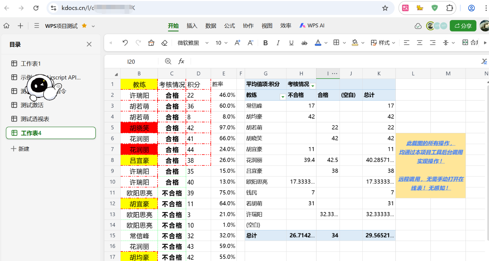
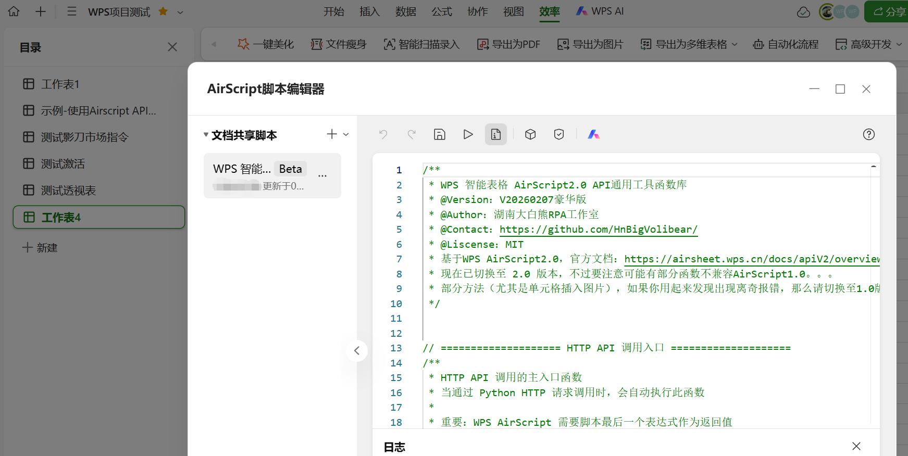

# wps_airscript2.0_online_tool
作者：湖南大白熊工作室
# ✨**手把手教你玩转WPS智能表格AirScript2.0在线读写操作工具！** 

---

## **📌 注意！请先确认你用的是 WPS 在线智能表格**
- 不是 WPS 普通在线表格！也不是 WPS 本地 Excel 文件！
- AirScript是使用2.0版本，而不是老的1.0版本！

> 这是一个使用Python编写的 简洁易用的 API 客户端工具，支持单元格读写、格式化设置、行列操作、查找替换、排序复制粘贴、工作表管理及批量数据处理等40+种常用功能！甚至可以实现按需筛选、增删改查数据透视表等复杂操作！开箱即用！几乎零依赖！



##### 顺便一提，如果你是Dify用户，可点击下面这里：
- 这是基于本项目封装的Dify插件，可供你在Dify工作流中直接使用！仅需拖拉拽即可实现各类复杂的在线表读写操作！非常适合编排智能体agent哦！
**👉 [配套的Dify插件](https://github.com/HnBigVolibear/dify_plugin_wps_airscript2.0_online_tool)**

---

# 快速开始

## **🚀 一、准备阶段**
- 注：如果你已经熟知了AirScript2.0的日常使用，可以直接跳过此部分，直接看后面的 **🛠️ 二、实际使用** 部分！
#### 你需要准备以下三个必填参数：  
`file_id`、`token`、`script_id` 即：表格ID、脚本令牌、脚本ID。

---

### **📝 初始化步骤详解**

#### **1. 新建 WPS 智能表格**
- 访问 **[金山文档 | WPS 云文档官网](https://www.kdocs.cn/latest)**
- 点击左上角 **「新建」** → 选择 **「智能表格」**
- 🚨 **特别注意**：必须是 **智能表格**，不是普通表格！
- 你可以先重命名表格，并手动填入一些初始数据或模板数据

---

#### **2. 创建 AirScript 脚本**
- 点击网页顶部 **「效率」** → **「高级开发」** → **「AirScript 脚本编辑器」**
- 在弹窗左上角找到 **「文档共享脚本」** 右侧的 **▼** 下拉按钮
- 选择 **「AirScript 2.0」**，创建一个新脚本
注：创建 AirScript 2.0 版本的脚本，脚本名称块块右侧都会有个“Beta”标识！

---

#### **3. 粘贴本客户端配套 JS 脚本**
- 将本项目中的 `wps_airscript_client_api.js` 文件内容，直接全部复制粘贴到你刚创建的 AirScript 脚本编辑器中即可！


---

#### **4. 获取 token令牌**
- 点击编辑器上方的 **「脚本令牌」** 按钮
- 生成并复制 `token`（令牌有效期为 **半年**，到期前可免费续期）
- ⚠️ 令牌过期会导致脚本报错！
- 每次需要提前去手动延期！延期可延长半年，无限延期，即实际上是永久免费的！

---

#### **5. 获取 file_id 和 script_id**
- 点击脚本名称右侧的 **「•••」** 按钮
- 选择 **「复制脚本 webhook」**
- 粘贴到文本框中，你会看到类似这样的链接： https://www.kdocs.cn/api/v3/ide/file/cnPc**nYee/script/V2-3hYQ****gHt5sB8l047/sync_task
##### 其中：
- `cnPc****nYee` 就是 **file_id** 表格ID
- `V2-3hYQ******gHt5sB8l047` 就是 **script_id** 脚本ID

---

#### **6. 开启表格分享**
- 关闭脚本编辑器，回到智能表格主界面
- 点击右上角 **「分享」** 按钮
- 打开 **「和他人一起查看/编辑」** 开关

---

## **🛠️ 二、实际使用**
现在，终于可以开始实际使用本Python客户端了！

本客户端工具提供以下常用功能模块：

- 📄 **单元格读写操作**
- 🎨 **格式化设置**（字体、颜色、对齐、边框等）
- 🔢 **行列操作**（插入、删除、调整大小）
- 🔍 **查找和替换**
- 📊 **排序和复制粘贴**
- 📑 **工作表管理**
- ⚡ **批量数据处理**
- 总共支持40+种操作，涵盖绝大部分的日常操作场景！ 

#### 使用示例：（或直接参考本项目的 `test.py` 文件！）

```python
from wps_airscript_client import WPSAirScriptClient

# ==================== 配置信息 ====================
FILE_ID = "cbK******2K"  # 替换为你的智能表格ID
TOKEN = "2Ze***************dry"  # 替换为你的 Token令牌
SCRIPT_ID = "V2-2vM******************D0iR"  # 替换为你的脚本ID
SHEET_NAME = "工作表4"  # 默认工作表名称

def get_client():
    """获取 API 客户端实例"""
    return WPSAirScriptClient(FILE_ID, TOKEN, SCRIPT_ID)

# ==================== 实际使用测试 ====================
"""测试获取单元格值"""
client = get_client()
result = client.get_cell_value("A2", SHEET_NAME)
print("获取单元格值:", result)

"""测试设置单元格值"""
client = get_client()
result = client.set_cell_value("E1", "备注", SHEET_NAME)
print("设置单元格值:", result)

"""测试获取区域值"""
client = get_client()
result = client.get_range_values("A1:D3", SHEET_NAME)
print("获取区域值:", result)

"""测试批量写入数据"""
client = get_client()
data = [
    ["姓名", "年龄", "部门", "工资"],
    ["张三", 25, "技术部", 9999],
    ["李四", 30, "市场部", 9000],
    ["王五", 28, "技术部", 8500],
]
# batch_write 现在使用 write_data，可以指定起始单元格
result = client.batch_write(data, start_cell="A1", sheet_name=SHEET_NAME)
print("批量写入:", result)

"""测试设置背景色"""
client = get_client()
color = client.rgb_to_excel_color(68, 114, 196)  # 蓝色
result = client.set_background_color("A1:D1", color, SHEET_NAME)
print("设置背景色:", result)

"""测试创建数据透视表"""
client = get_client()
result = client.create_pivot(
    source_sheet_name="原始数据Sheet",
    source_range="A1:D9999", # "A:D"
    row_column_indices=[1,2],
    column_column_indices=[3],
    value_column_indices=[4],
    function_type="sum",
    target_sheet_name="透视表新Sheet",
    target_cell="A1"
)

```

---

## **📚 其他说明**
#### 参考链接 & 鸣谢：
- [WPS 智能表格 API 文档](https://www.kdocs.cn/l/cftIrDJVIvCU)
- [应道社区讨论](https://www.yingdao.com/community/detaildiscuss?id=885400393968951296)
- **WPS 官方 AirScript 文档**：[点击查看](https://airsheet.wps.cn/docs/apitoken/intro.html)

---

### **👨‍💻 联系我**
- 湖南大白熊工作室 
- https://github.com/HnBigVolibear
如有技术问题或改进建议，欢迎联系：  
📧 **1486203070@qq.com**

---

### Sponsor Me 捐赠我：


> 让数据流动起来，让表格变得更聪明！祝你使用愉快！ 🚀